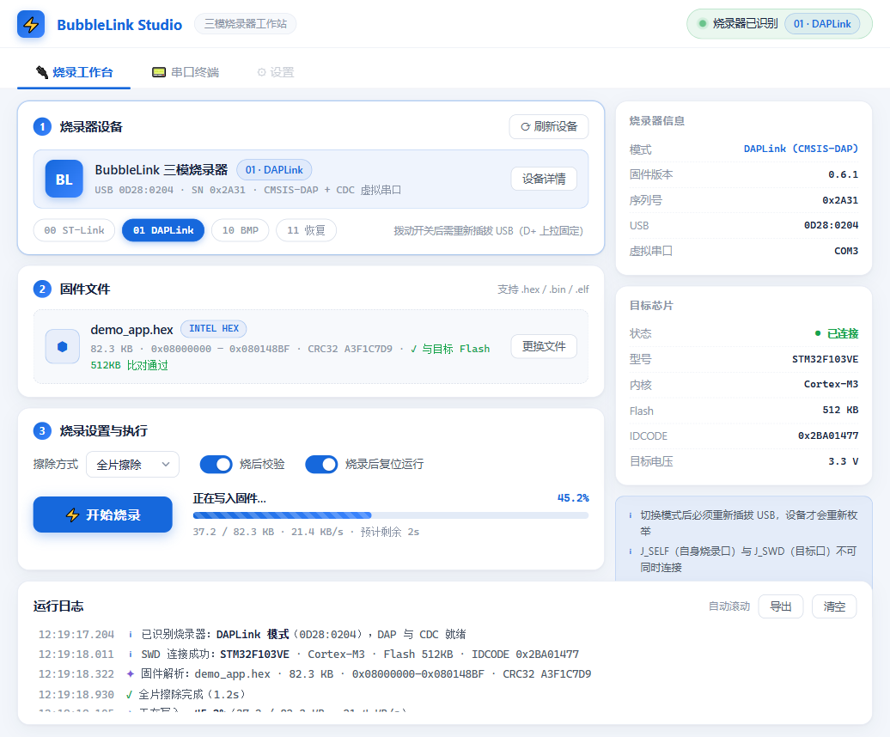
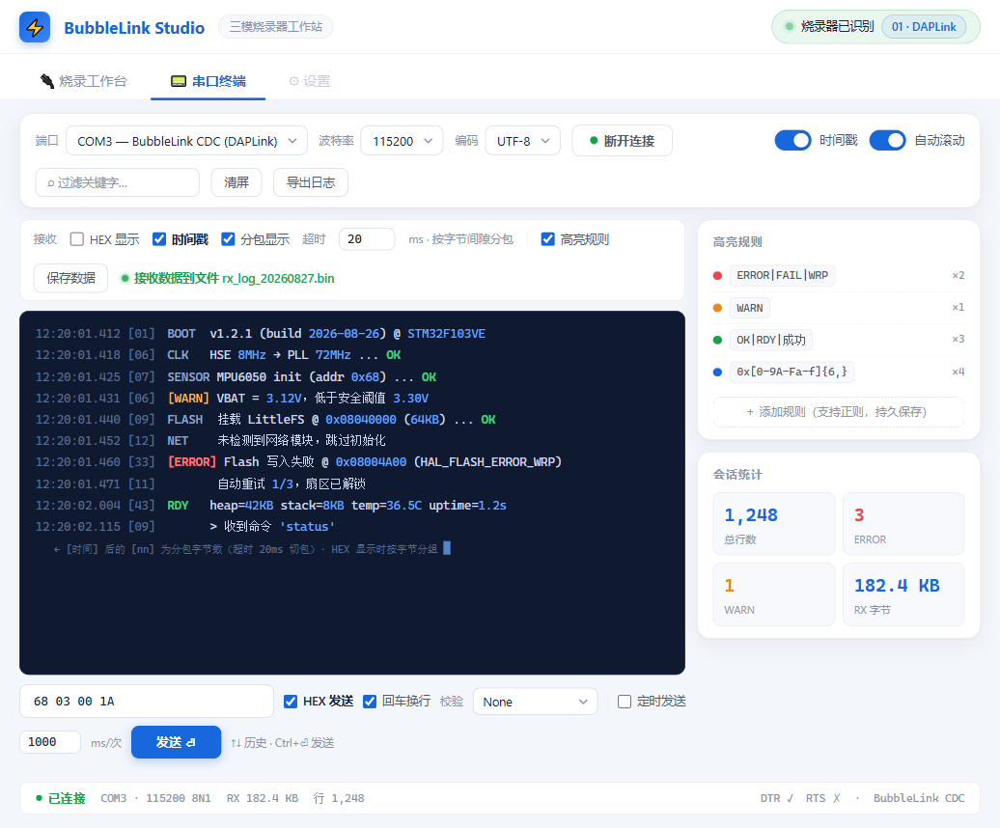

# ⚡ BubbleLink Studio

> **三模烧录器工作站** —— 一个自研三模硬件调试器（ST-Link / DAPLink / BMP）的上位机
> 串口终端 + 双引擎烧录工作台，Tauri 2 + React + Rust 构建

**🧪 当前状态：`v0.9.1-beta` 公开测试版** —— 功能已完整，正在等待硬件实测反馈。
欢迎提 Issue 反馈问题；正式版将在实测清单通过后发布。

---

## 📖 简介

BubbleLink Studio 是为一个三模式硬件调试器量身打造的上位机。调试器通过拨动开关切换
ST-Link / DAPLink / Black Magic Probe 三种固件模式，本软件负责另外两件事：

1. **烧录工作台** —— 识别当前模式，自动选择烧录引擎，把固件烧进目标板
2. **串口终端** —— 通过 DAPLink 的 CDC 虚拟串口查看/收发目标板日志

## 🖼 界面预览

| 烧录工作台 | 串口终端 |
|---|---|
|  |  |

## ✨ 功能

**烧录工作台**
- 三模设备自动识别（USB 双源判定，2 秒自动探测 + 手动刷新）
- 双引擎按模式自动分发：
  - `01 DAPLink` → **pyOCD**
  - `00 ST-Link` → **STM32CubeProgrammer CLI**
  - `10 BMP` → 提示走 gdb / VS Code 工作流
- 目标芯片**自动识别**（读 DBGMCU_IDCODE + Flash 容量寄存器，推断密度/型号）
- 固件解析：`.hex` 自动给出地址范围与 CRC32；支持 `.bin`（自定基地址）与 `.elf`
- 全片/扇区擦除、烧后校验、完成自动复位运行、阶段化进度条、任务取消
- 引擎输出实时日志（错误红 / 成功绿）

**串口终端**
- 端口自动枚举（系统友好名称）、波特率 1200–921600、UTF-8/GBK
- 按字节间隙**分包**（默认 20ms）+ 时间戳 + 分包字节数标注
- HEX / 文本双显、正则过滤、**高亮规则**（内置 ERROR/WARN/OK/地址，可自定义并持久化）
- 发送：文本/HEX、回车换行、帧尾校验（SUM / CRC8 / CRC16-MODBUS）、**定时循环发送**、历史记录
- 接收数据原始字节流落盘、日志导出、会话统计（行数 / ERROR / WARN / RX）
- DTR / RTS 实时控制

**工程与体验**
- Tauri 2：安装包 ~2MB，运行内存 ~23MB（对比 Electron 方案 ~90MB/200MB+）
- 全部设置持久化；键盘可达的自定义下拉；界面组件适配自个人组件库（蓝白主题）

## 📦 下载安装

前往 [**Releases**](https://github.com/bubble0462/BubbleLink/releases) 下载 `v0.9.1-beta`：

| 文件 | 说明 |
|---|---|
| `BubbleLink_Studio_0.9.1_beta_setup.exe` | 安装包（2MB）：中文向导、免管理员、自动创建快捷方式、带卸载器 |
| `BubbleLink_Studio_0.9.1_beta_portable.exe` | 便携版（9MB）：单文件双击即用 |

> 需要 Windows 10/11（系统自带 WebView2 即可，无需装浏览器）。

### 运行依赖

- 烧录模式 01：`pip install pyocd`（一次即可）
- 烧录模式 00：安装 [STM32CubeProgrammer](https://www.st.com/en/development-tools/stm32cubeprog.html)
  （自定义路径可用环境变量 `STM32CUBE_PROGRAMMER_PATH` 指定）
- 串口终端：无额外依赖

## 🚀 快速上手

```text
烧录：烧录器拨 00 或 01 → 插 USB → 打开「烧录工作台」→ 徽章亮起
      → 选固件 → ⚡ 开始烧录（完成后目标自动复位运行）

串口：烧录器拨 01 → 插 USB → 「串口终端」→ 选择 CDC 端口 → 连接
      （虚拟串口对应目标板 USART1：PA9/PA10）
```

> ⚠️ 三模共用 USB，切换模式后**必须重新插拔 USB**（D+ 上拉固定，需重新枚举）。

## 🛠 本地开发

```bash
git clone https://github.com/bubble0462/BubbleLink.git
cd BubbleLink
npm install
npx tauri dev        # 开发调试（热重载）
cargo test           # Rust 单元测试（src-tauri 下）
npx tauri build      # 出正式安装包 + 便携 exe
```

> 出正式版必须用 `npx tauri build`，直接 `cargo build` 会得到开发模式二进制
> （打开显示 localhost 拒绝连接），详见 [#开发注意事项](README.md)。

## 🗺 路线图

- [x] 串口终端完整版
- [x] DAPLink 烧录（pyOCD）
- [x] ST-Link 烧录（STM32CubeProgrammer CLI）
- [x] 目标芯片自动识别
- [x] NSIS 安装包
- [ ] 硬件实测反馈修复 → **v1.0 正式版**
- [ ] 模式 11 恢复口：给烧录器自身刷固件（救砖/自升级）
- [ ] BMP 模式页面内支持（gdb 桥）
- [ ] 多设备序列号选择

## ⚠️ Beta 声明

本版本为**公开测试版**：核心链路（双引擎烧录、串口终端）已通过构建与单元测试，
但尚未完成成体系的硬件实测。在目标板上烧录前，请先用无关紧要的测试固件验证。
欢迎通过 Issue 反馈问题与建议。

## 📄 许可证

[MIT](LICENSE)
